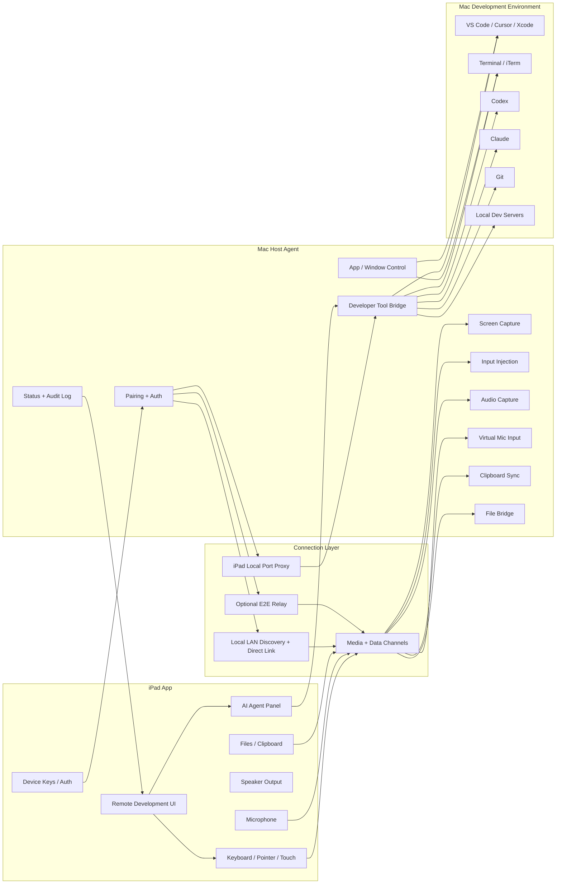
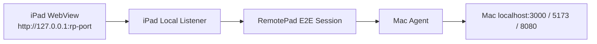
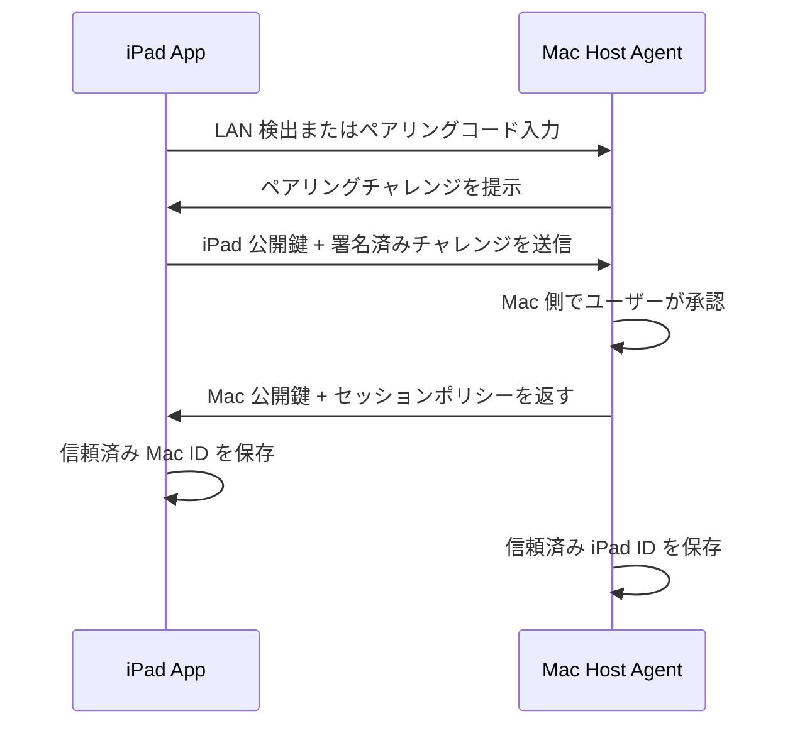
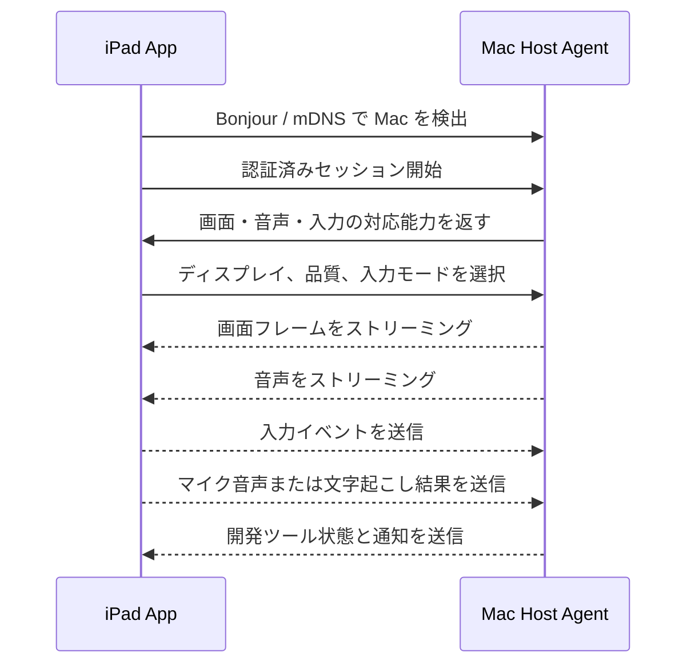
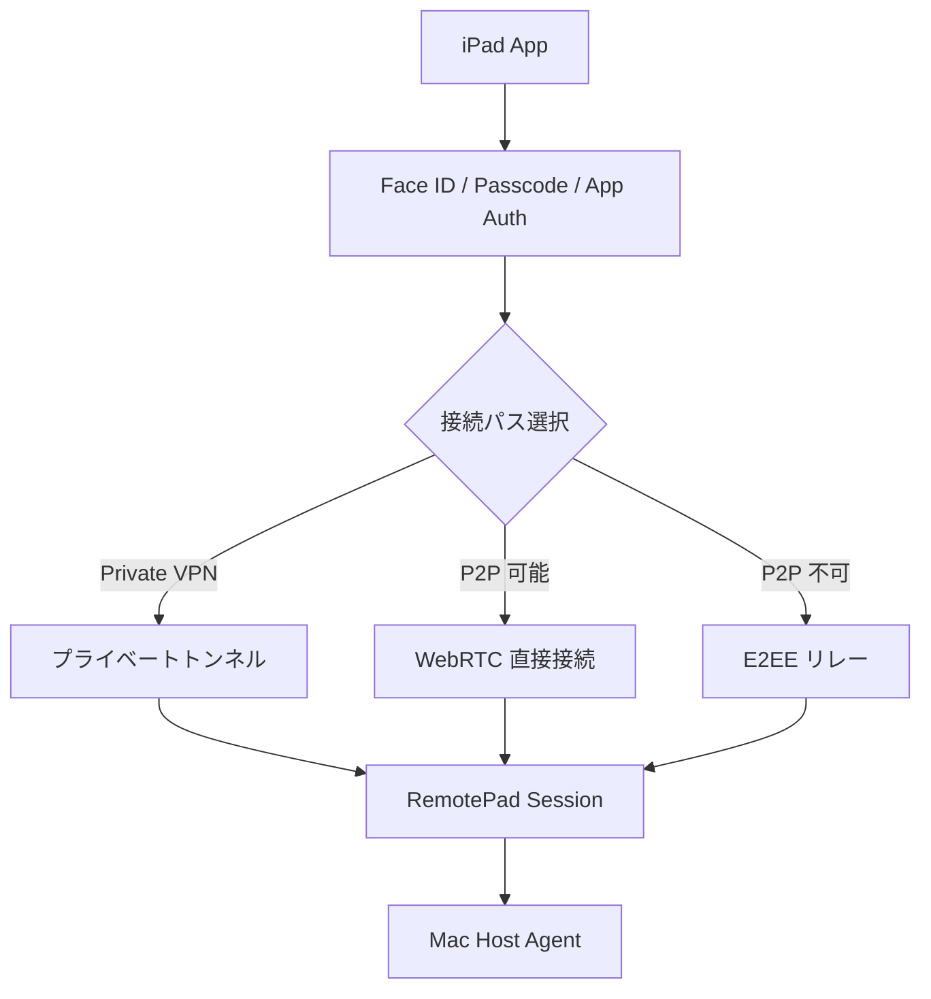

# RemotePad アーキテクチャ設計

RemotePad は、常時起動している Mac の開発環境を iPad から安全に操作するためのリモート開発クライアントです。Mac は VS Code、Cursor、Xcode、Terminal、Codex、Claude、ローカル開発サーバー、ビルドツールを動かす開発母艦として扱います。iPad は画面共有、キーボード、ポインタ、音声、ファイル、クリップボード、AI エージェント操作のための専用フロントエンドになります。

## 目的

- ローカルネットワーク内でも外出先でも Mac に安全に接続できる。
- 低遅延の画面共有、キーボード、マウス、トラックパッド、タッチ操作を提供する。
- ターミナル、画面共有、AI エージェント操作、ファイル、音声を単一アプリで扱える。
- iPad の音声入力を Mac や AI エージェントへ渡せる。
- Mac の音声出力を iPad で聞ける。
- Codex、Claude、Terminal、Git、エディタ、ローカル開発サーバーを扱う開発コックピットを提供する。
- Mac 側で接続状態、操作状態、監査ログを確認できる。
- まずはローカル MVP から始め、外出先接続、音声、AI 連携を段階的に強化できる構造にする。

## プロダクト原則

RemotePad は単なる SSH アプリでも、単なる画面共有アプリでもありません。強みは「開発に特化していること」と「単一アプリで開発作業を完結できること」です。

原則:

- 開発作業に必要な Terminal、画面共有、Codex、Claude、Git、ファイル、音声を一体化する。
- 接続前に別アプリや別 VPN を手動起動しなくても使える体験を目指す。
- SSH や画面共有は機能の一部であり、主役は開発コックピットである。
- セキュリティと低遅延を最優先の品質として扱う。
- 外出先接続でも Mac を公開せず、Mac Agent からの外向き接続や E2E リレーを優先する。
- UI は iPad ネイティブで、外部キーボード、トラックパッド、Apple Pencil、音声入力に最適化する。
- 汎用リモート操作よりも、AI 開発エージェントの入力待ち、差分確認、テスト実行、承認操作を素早く行えることを重視する。

## 非目的

- 初期段階から汎用リモートデスクトップ製品を完全に置き換えること。
- Mac を認証なしで直接インターネット公開すること。
- 特定の AI プロバイダやエディタだけに依存すること。
- Mac 上のネイティブ開発環境を捨てること。

## 全体アーキテクチャ

## 主要コンポーネント

### iPad App

iPad App は RemotePad のメイン体験です。外部キーボード、トラックパッド、Apple Pencil、Stage Manager、Split View、タッチ操作を前提に設計します。

役割:

- 信頼済み Mac とのペアリング。
- Face ID、パスコード、アプリ内認証による接続前アンロック。
- ローカルネットワーク上の Mac 検出。
- 外出先からの VPN、P2P、リレー接続。
- Mac 画面ストリームの表示。
- キーボード、ポインタ、タッチ、ジェスチャイベントの送信。
- マイク音声または文字起こし結果の送信。
- Mac 音声の再生。
- クリップボード同期とファイル転送。
- 開発コマンドパレット。
- Codex、Claude、Terminal、Git、開発サーバー状態の表示。

### Mac Host Agent

Mac Host Agent は Mac に常駐するアプリまたはバックグラウンドサービスです。iPad 単体ではできない画面キャプチャ、入力注入、音声、アプリ操作、開発ツール連携を担当します。

役割:

- ペアリングと信頼済みデバイス鍵の管理。
- セキュアなローカルエンドポイントの提供。
- 暗号化セッションの確立。
- ディスプレイフレームのキャプチャ。
- システム音声またはアプリ音声のキャプチャ。
- キーボードとポインタイベントの注入。
- 必要に応じた仮想マイク入力。
- クリップボード同期。
- 許可された場所へのファイル転送。
- アプリやウィンドウの切り替え。
- 開発ツールの状態監視。
- 接続状態、通知、監査ログの提供。

想定される macOS 権限:

- 画面収録
- アクセシビリティ
- 必要に応じて入力監視
- マイク
- 特定アプリ操作のためのオートメーション
- ファイルブリッジで必要な場合のみフルディスクアクセス

### Connection Layer

接続方式は複数持ちますが、アプリケーション層のプロトコルはできるだけ共通化します。

接続パス:

- ローカル LAN での直接接続。
- iPad 側ローカルポートから Mac 側 localhost へ接続する開発サーバープロキシ。
- 直接接続できない場合の E2E セキュアリレー。

推奨トランスポート:

- 画面、音声、マイク、低遅延入力には WebRTC。
- ペアリング、制御 API、状態取得、コマンド結果には HTTPS または WebSocket。
- リレーを使う場合でもデバイス鍵に基づくエンドツーエンド暗号化。

VPN / ZTNA / Tailscale / WireGuard は設計上の参考または検証手段として扱います。RemotePad の最終 UX は、別アプリの手動起動を前提にせず、Mac Agent と iPad App のセッション内に接続制御を内包します。

### Browser Access Model

開発サーバー確認では、WebView の origin と localhost の扱いが重要です。RemotePad は次のモデルを本命にします。

方針:

- iPad WebView は iPad 側 `127.0.0.1` に接続する。
- iPad App のローカルリスナーが RemotePad セッションへ変換する。
- Mac Agent は Mac 側 `127.0.0.1:<target-port>` へ接続する。
- HTTP request / response だけでなく、WebSocket、SSE、HMR、chunked response を扱える双方向ストリームを優先する。
- 現在の HTTP-aware BrowserProxy は方式検証用であり、最終仕様ではローカルポートプロキシに統合する。

### Developer Tool Bridge

Developer Tool Bridge は RemotePad を単なるリモートデスクトップではなく、開発専用クライアントにするための層です。

機能:

- VS Code、Cursor、Xcode、Terminal、iTerm、Codex、Claude の起動またはフォーカス。
- Codex と Claude の実行中セッション表示。
- Terminal の実行中コマンドや入力待ち状態の表示。
- Git ブランチ、ステータス、差分概要、最近のコミット表示。
- テスト、lint、build、開発サーバー再起動などの定型コマンド実行。
- ローカル開発サーバー URL の表示。
- Codex や Claude がユーザー入力を待っている場合の iPad 通知。

## データフロー

### ペアリング

ペアリングは少なくとも初回だけローカルまたは物理的な確認を必須にします。ペアリング後の外出先接続可否は Mac 側ポリシーで制御します。

### ローカルセッション

### 外出先セッション

外出先接続は LAN 接続より強い条件にします。例として Face ID 再認証、デバイス許可リスト、Mac 側の追加承認、短いアイドルタイムアウトを設定できます。

## セキュリティモデル

セキュリティは後付けではなく、製品価値の中心として設計します。

原則:

- Mac は未認証の公開制御エンドポイントを持たない。
- iPad ごとに個別の鍵ペアを持ち、個別に失効できる。
- ペアリングにはローカルまたは物理的な確認を要求する。
- セッションはエンドツーエンドで暗号化する。
- リモート操作中は Mac 側に接続状態を常時表示する。
- センシティブな操作には明示的な許可または高い信頼レベルを要求する。
- 一定時間操作がない場合は自動ロックする。
- 外出先接続は LAN 接続より厳しいポリシーを適用できる。

推奨コントロール:

- iOS Keychain と macOS Keychain にデバイス鍵を保存。
- 接続前に Face ID またはパスコードを要求。
- デバイスごとの権限設定: 画面、入力、音声、ファイル、開発コマンド。
- 接続プロファイル: ローカルのみ、VPN のみ、リレー許可。
- 監査ログ: 接続端末、時刻、接続パス、操作、ファイル転送、コマンド実行。
- Mac メニューバーからの緊急切断。
- 閲覧のみモード。

### 現在の実装ゲート

本物の UI ペアリング、Mac 側承認、デバイス失効、監査ログが実装されるまでは、Mac Agent は開発用ローカル検証モードのみ許可します。

- 待受は `127.0.0.1` のみに固定する。
- Bonjour / mDNS のサービス公開は無効にする。
- LAN IP、`0.0.0.0`、Relay、外出先接続では起動しない。
- 現在の署名チャレンジ検証は loopback-only の開発用 trust-on-first-use であり、LAN や Relay の信頼境界として扱わない。

この制約を外す条件は、Mac 側承認つきペアリング、信頼済みMac/iPad IDの永続化、失効フロー、監査ログの最小実装が揃うことです。

### Threat Model

初期設計で明示的に扱う攻撃者:

- 同一 LAN 上の攻撃者: Bonjour spoofing、接続試行、リプレイ、ポートスキャンを行える。
- 悪意ある Relay: 経路情報とメタデータを観測できるが、セッション内容は読めない設計にする。
- 紛失した iPad: Keychain 保護、Face ID / passcode、デバイス失効で被害を制限する。
- 紛失または侵害された Mac: Mac 側の接続状態表示、緊急切断、端末失効、監査ログで検知と遮断を可能にする。
- 開発サーバー由来のページ: WebView 内で任意の JavaScript が動く前提で、RemotePad 制御APIとWebView originを分離する。

Discovery は信頼根ではありません。Bonjour / mDNS の情報は接続候補を見つけるためのヒントであり、信頼はペアリング時に保存した pinned public key と署名検証で確立します。

## 画面共有と入力

画面共有モード:

- 編集やターミナル操作向けの低遅延モード。
- デザイン確認や細部確認向けの高画質モード。
- ネットワーク状況に応じた自動調整モード。
- 単一ディスプレイ、全ディスプレイ、特定ウィンドウ、特定アプリ共有。

入力モード:

- iPad の外部キーボードとトラックパッド。
- タッチを Mac ポインタ操作に変換するモード。
- Apple Pencil による精密ポインティング。
- Esc、Tab、Ctrl、Option、Cmd、矢印、Function キーを含む開発者向け補助バー。
- よく使う Mac 操作と開発操作のショートカットパレット。

注意点:

- Mac の修飾キー挙動を正確に保つ。
- 日本語入力切り替えを丁寧に扱う。
- ポインタ位置を見失わないための表示補助を用意する。
- iPad 側のズームやパンで Mac 解像度が不用意に変わらないようにする。

## 音声入力と音声出力

音声出力:

- Mac のシステム音声またはアプリ音声を iPad に転送する。
- 低遅延モードと高音質モードを切り替えられる。
- 必要に応じてミュートや音声ソース選択を提供する。

音声入力:

- iPad マイクから Mac への Push-to-Talk。
- 必要に応じた常時マイク転送。
- iPad 側で文字起こしし、フォーカス中のアプリや AI プロンプトへテキストとして送信。
- 「テスト実行」「Codex を開く」「差分を見せて」などの音声コマンド。

実装上の注意:

macOS で仮想マイクとして入力するには、仮想オーディオドライバや既存の仮想音声デバイス連携が必要になる可能性があります。基本的な画面共有と入力操作とは別マイルストーンとして扱います。

## 開発コックピット

開発コックピットは、画面共有を毎回細かく操作しなくても開発作業を進められる iPad ネイティブ UI です。

主要ビュー:

- Screen View
- Terminal View
- AI Agents View
- Git View
- Files / Clipboard View
- Dev Servers View
- Connection / Security View

コマンドパレット例:

- エディタにフォーカス。
- Terminal にフォーカス。
- Codex を開く。
- Claude を開く。
- テスト実行。
- lint 実行。
- 開発サーバー再起動。
- Git 差分表示。
- コミット作成。
- ローカル開発サーバーを iPad 側ブラウザで開く。
- iPad のクリップボードを Mac に送る。
- 生成物を iPad にダウンロード。

AI エージェント機能:

- 実行中の Codex / Claude セッション一覧。
- 入力待ちセッションの表示。
- テキストまたは音声文字起こしプロンプトの送信。
- 生成された差分概要の表示。
- テスト結果とコマンド出力の表示。
- 承認待ち通知。
- タスクの継続、停止、一時停止。

## ファイルとクリップボード

機能:

- 双方向クリップボード同期。
- iPad から Mac へのファイルアップロード。
- Mac で生成されたファイルの iPad ダウンロード。
- スクリーンショット、PDF、画像、メモを指定プロジェクトへ投入。
- 任意でプロジェクトスコープのファイルブラウザ。

セキュリティ制約:

- 初期状態では広範囲のディスクアクセスではなく、明示的なプロジェクトフォルダを対象にする。
- ファイル転送履歴を表示する。
- 上書き前に確認する。
- デバイスごとにファイルアクセス権限を設定できる。

## マイルストーン

### Milestone 1: Local MVP

- Mac Host Agent。
- iPad App。
- 仮認証中の loopback-only 安全ゲート。
- フレーム仕様の固定。
- ローカル LAN 検出。
- 信頼済みデバイス鍵によるペアリング。
- 認証済みローカルセッション。
- Mac Agent 経由の Terminal セッション。
- Terminal セッションの永続化。
- Mac でローカル起動している開発サーバーへの iPad ブラウザ接続。
- iPad ローカルポートプロキシ。
- WebView localhost origin 検証。
- 開発サーバー一覧。
- Codex / Claude CLI ワークフロー。
- 基本的な接続状態表示。
- 手動切断。

### Milestone 2: Developer Usability

- 開発者向け補助キーバー。
- クリップボード同期。
- コマンドパレット。
- Terminal とエディタ向けショートカット。
- 基本的な Git ステータス。
- diff / test / lint / build の補助 UI。
- Codex / Claude の入力待ち通知。

### Milestone 3: Screen Control

- 低遅延画面共有。
- キーボードとポインタ入力。
- アプリとウィンドウのフォーカスコマンド。
- Codex / Claude Mac アプリの起動またはフォーカス。
- ブラウザ、エディタ、シミュレータ、ネイティブアプリの実行確認。

### Milestone 4: Remote Access

- アプリ層 E2E 暗号の確定。
- 必要に応じた E2E リレー対応。
- P2P 直接接続への昇格。
- 外出先接続向けの強化ポリシー。
- 接続品質の自動調整。
- セッション監査ログ。
- デバイス失効。

### Milestone 5: Audio and Voice

- Mac 音声の iPad 転送。
- Push-to-Talk マイク転送。
- 音声文字起こしによるプロンプト入力。
- 音声コマンド。
- 必要に応じた仮想マイク対応。

### Milestone 6: Full Development Cockpit

- AI エージェントセッション追跡。
- 入力待ち通知。
- test / lint / build 連携。
- 開発サーバーダッシュボード。
- ファイル転送ワークフロー。
- プロジェクトスコープのファイルブラウザ。
- diff、ログ、生成物を確認する iPad ネイティブ UI。

## 未決定事項

- 外出先接続は最初から専用リレーを作るか、まずは Tailscale / WireGuard 系のプライベート VPN 前提にするか。
- 画面ストリーミングは最初から WebRTC にするか、ローカル MVP だけより簡易な方式で始めるか。
- v1 で第一級対応する Mac アプリは VS Code、Cursor、Terminal、iTerm、Codex、Claude のどこまでか。
- Codex / Claude 連携はプロセス監視、CLI 連携、UI オートメーションのどれから始めるか。
- ファイルアクセスをどの範囲まで許可するか。
- 音声文字起こしは iPad、Mac、クラウドのどこで行うか。
- 個人利用から始めるか、チーム利用や複数ユーザー権限を早期に設計するか。

## 初期方針

最初はローカル MVP で一番重要な操作ループを検証します。つまり、iPad から Mac へ入力を送り、Mac の画面を iPad に返し、信頼済みデバイスだけが接続できる状態を作ります。その後すぐに開発コックピットを追加し、RemotePad 固有の価値である Codex、Claude、Terminal、Git、開発サーバー操作を強化します。外出先接続と音声は、基本操作体験が安定してから段階的に加えるのが現実的です。
