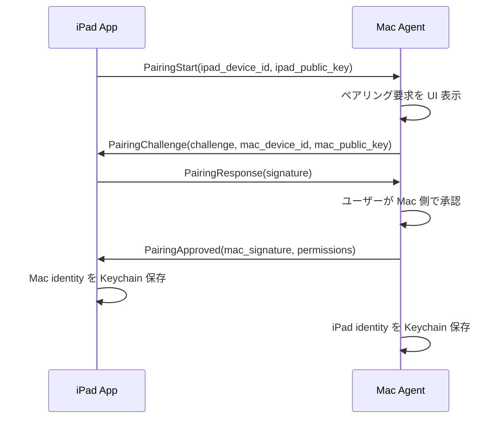
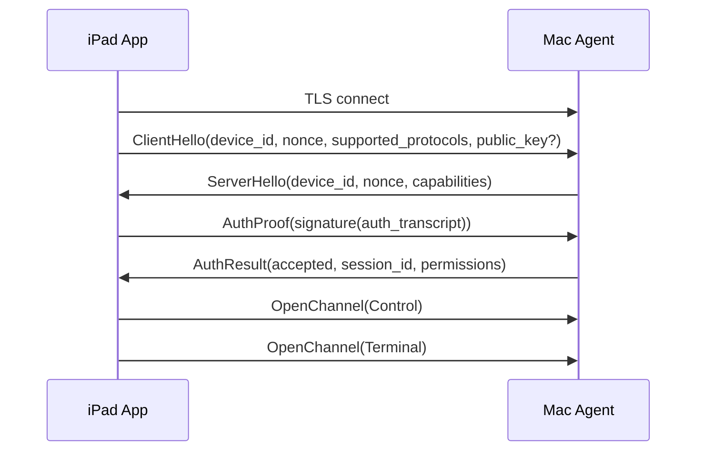

# RemotePad プロトコル仕様案

このドキュメントは MVP 実装に必要な RemotePad セッションプロトコルの初期案です。MVP では `Control`、`Terminal`、`BrowserProxy` の 3 系統を優先し、将来の `Screen`、`Audio`、`DevTools`、`Clipboard` に拡張できる構造にします。

## 設計方針

- iPad App と Mac Agent の間に 1 つの認証済みセッションを確立する。
- セッション内に複数の論理チャネルを multiplex する。
- MVP は LAN 直結を前提にするが、Relay 経由でも同じプロトコルを使えるようにする。
- Terminal と BrowserProxy は低遅延を重視する。
- メッセージはバイナリフレーム + JSON ヘッダ + 任意のバイナリ payload を基本形にする。
- 認証、鍵交換、端末識別、権限は Control チャネルで扱う。

## 接続レイヤ

### MVP

- Discovery: Bonjour / mDNS
- Transport: TCP + TLS
- Auth: デバイス鍵 + 初回ペアリング
- Session: TLS 確立後に RemotePad 論理チャネルを開始

実装ゲート:

- 現在の開発実装では署名チャレンジ検証を行う。
- UI ペアリング、Mac 側承認、デバイス失効、監査ログが未実装のため、Mac Agent は `127.0.0.1` のみで待ち受け、Bonjour / mDNS を公開しない。
- LAN Discovery、LAN 待受、Relay 接続は、ペアリングと失効フローの実装後に有効化する。

### 将来

- Relay: WebSocket または QUIC
- P2P: WebRTC DataChannel または QUIC
- Media: WebRTC
- E2E: Noise 系を含むアプリ層暗号を検討する

MVP では TCP + TLS で始めます。将来の Relay では、同じ RemotePad フレームを WebSocket または QUIC stream に載せ替えます。

## Bonjour / mDNS

Mac Agent は LAN 上でサービスを公開します。

Service Type:

```text
_remotepad._tcp
```

TXT record 例:

```text
version=1
device_id=<mac-device-id>
host_name=<display-name>
capabilities=control,terminal,browser_proxy
pairing=available|disabled
```

iPad App は `_remotepad._tcp` を探索し、未ペアリング Mac とペアリング済み Mac を一覧表示します。

Bonjour / mDNS は信頼根ではなく Discovery hint です。TXT record は偽装され得るため、接続先の信頼はペアリング時に保存した Mac public key と署名検証で確立します。

## デバイス ID と鍵

各端末は RemotePad 用のデバイス ID と鍵ペアを持ちます。

### Device Identity

- `device_id`: UUID v4
- `device_name`: ユーザー表示名
- `device_type`: `ipad` または `mac`
- `public_key`: 端末公開鍵
- `created_at`: 作成日時

### Key Storage

- iPad: iOS Keychain
- Mac: macOS Keychain

### 推奨鍵

初期案:

- 署名鍵: Ed25519
- セッション鍵: X25519 key agreement
- 暗号化: TLS 1.3 + アプリケーション層の署名チャレンジ

MVP では TLS でトランスポートを保護し、ペアリング済み公開鍵による署名チャレンジで端末認証します。

## ペアリングフロー



ペアリングは Mac 側の明示承認を必須にします。承認後、Mac は iPad 端末ごとの権限を保存します。

初期権限:

```json
{
  "terminal": true,
  "browser_proxy": true,
  "clipboard": false,
  "screen": false,
  "audio": false,
  "devtools": true
}
```

## セッション開始フロー



セッション開始時に能力交換を行い、利用可能なチャネルと権限を確定します。

現在の開発実装では、dev-client が Curve25519 signing public key を `ClientHello.public_key` で送り、`RemotePad auth v1` transcript に署名します。Mac Agent は明示的に登録された公開鍵だけを信頼し、保存済み公開鍵で `AuthProof.signature` を検証します。

本実装では、初回ペアリング時に Mac 側の明示承認を必須にし、保存済みの信頼済み公開鍵だけを使います。`ClientHello.public_key` は未ペアリング時の候補情報であり、信頼済み端末の認証根としては扱いません。

### protocol_version_unsupported

`ClientHello.supported_protocols` にサーバーの `RemotePadProtocol.currentVersion` が含まれない場合、サーバーは `protocol_version_unsupported` を返して接続を終了可能にします。

エラーには次を含めます。

```json
{
  "kind": "error",
  "code": "protocol_version_unsupported",
  "message": "Client does not support protocol 1.",
  "request_id": 1,
  "supported_protocols": [1],
  "minimum_supported_protocol": 1
}
```

クライアントはこのエラーを受け取った場合、再試行せずアプリ更新を促します。

## フレーム形式

MVP では実装しやすさを優先し、以下のフレーム形式を提案します。

```text
+----------------+----------------+----------------+----------------+
| magic 4 bytes   | version 1 byte | type 1 byte    | flags 2 bytes  |
+----------------+----------------+----------------+----------------+
| channel_id 4 bytes              | request_id 4 bytes             |
+----------------+----------------+----------------+----------------+
| header_len 4 bytes              | payload_len 4 bytes            |
+----------------+----------------+----------------+----------------+
| JSON header bytes                                              |
+----------------------------------------------------------------+
| payload bytes, optional                                        |
+----------------------------------------------------------------+
```

Fields:

- `magic`: `RPAD`
- `version`: `1`
- `type`: frame type
- `flags`: compression, ack, error など
- `channel_id`: 論理チャネル ID
- `request_id`: request / response 対応用
- `header_len`: JSON header 長
- `payload_len`: payload 長

Encoding:

- multi-byte integer は network byte order、つまり big-endian とする。
- `channel_id` と `request_id` は unsigned 32-bit integer とする。
- `request_id = 0` は unsolicited data / event に利用できる。
- JSON header は UTF-8 とする。
- `header_len` の最大値は 64 KB。
- `payload_len` の最大値は 16 MB。

Flags:

- `compressed`: payload が圧縮されていることを示す。現時点では negotiation 未実装のため送信しない。
- `acknowledgement`: 将来予約。
- `error`: error response を示す。

圧縮は capability exchange で合意した後にのみ使用します。現在の実装では圧縮交渉が未実装のため、`compressed` frame を受け取った場合は decode 時点で拒否します。

Frame types:

```text
0x01 control
0x02 open_channel
0x03 close_channel
0x04 data
0x05 request
0x06 response
0x07 error
0x08 ping
0x09 pong
```

## チャネル

### Control

セッション全体の状態管理を行います。

用途:

- capability exchange
- permission check
- ping / pong
- session status
- reconnect
- error notification
- audit event

代表メッセージ:

```json
{
  "kind": "session.status",
  "session_id": "uuid",
  "connected_at": "2026-06-03T00:00:00Z",
  "permissions": {
    "terminal": true,
    "browser_proxy": true
  }
}
```

### Terminal

Mac Agent 管理 PTY の入出力を扱います。

Terminal session create:

```json
{
  "kind": "terminal.create",
  "shell": "/bin/zsh",
  "cwd": "/Users/nao/Documents",
  "cols": 120,
  "rows": 36,
  "env": {
    "TERM": "xterm-256color"
  }
}
```

Terminal created:

```json
{
  "kind": "terminal.created",
  "terminal_id": "uuid",
  "shell": "/bin/zsh",
  "cwd": "/Users/nao/Documents/RemotePad",
  "cols": 120,
  "rows": 36,
  "state": "running"
}
```

Terminal output:

```json
{
  "kind": "terminal.output",
  "terminal_id": "uuid",
  "encoding": "utf8"
}
```

`payload` に PTY output bytes を入れます。

Terminal input:

```json
{
  "kind": "terminal.input",
  "terminal_id": "uuid"
}
```

`payload` に key input bytes を入れます。

Resize:

```json
{
  "kind": "terminal.resize",
  "terminal_id": "uuid",
  "cols": 120,
  "rows": 36
}
```

Session list:

```json
{
  "kind": "terminal.list"
}
```

Session list result:

```json
{
  "kind": "terminal.list.result",
  "terminals": [
    {
      "terminal_id": "uuid",
      "title": "zsh - RemotePad",
      "shell": "/bin/zsh",
      "cwd": "/Users/nao/Documents/RemotePad",
      "cols": 120,
      "rows": 36,
      "state": "running",
      "created_at": "2026-06-03T00:00:00Z",
      "last_active_at": "2026-06-03T00:10:00Z"
    }
  ]
}
```

Attach to existing terminal:

```json
{
  "kind": "terminal.attach",
  "terminal_id": "uuid"
}
```

Attached response:

```json
{
  "kind": "terminal.attached",
  "terminal": {
    "terminal_id": "uuid",
    "title": "zsh - RemotePad",
    "shell": "/bin/zsh",
    "cwd": "/Users/nao/Documents/RemotePad",
    "cols": 120,
    "rows": 36,
    "state": "running",
    "created_at": "2026-06-03T00:00:00Z",
    "last_active_at": "2026-06-03T00:10:00Z"
  }
}
```

After `terminal.attached`, the agent sends a `terminal.output` frame containing the terminal's recent output replay when buffered output exists. The initial implementation keeps the last 512 KB per terminal.

Close terminal:

```json
{
  "kind": "terminal.close",
  "terminal_id": "uuid"
}
```

Closed response:

```json
{
  "kind": "terminal.closed",
  "terminal_id": "uuid",
  "reason": "client_requested"
}
```

### BrowserProxy

iPad から Mac 側 localhost へアクセスするためのプロキシです。

初期実装では HTTP request / response と TCP stream に対応します。HTTP request / response は方式検証用のスパイクです。WebSocket、HMR、SSE、chunked response、大きな body を壊さない本命方式として、iPad 側ローカルリスナーと BrowserProxy stream を採用します。

HTTP request:

```json
{
  "kind": "browser.request",
  "request_id": "uuid",
  "method": "GET",
  "target": {
    "host": "127.0.0.1",
    "port": 3000,
    "scheme": "http",
    "path": "/"
  },
  "headers": {
    "User-Agent": "RemotePad/1.0"
  }
}
```

HTTP response:

```json
{
  "kind": "browser.response",
  "request_id": "uuid",
  "status": 200,
  "headers": {
    "Content-Type": "text/html"
  }
}
```

`payload` に response body bytes を入れます。

制約:

- 現在のHTTP方式は response body 全体を1フレームに載せる。
- 16 MB を超える body、streaming response、SSE、HMR、WebSocket は対象外。
- 実アプリのWebView表示には使用せず、ローカルポートプロキシの検証前段として扱う。

Browser stream open:

```json
{
  "kind": "browser.stream.open",
  "stream_id": "uuid",
  "target": {
    "host": "127.0.0.1",
    "port": 5173,
    "scheme": "tcp",
    "path": ""
  }
}
```

Browser stream data:

```json
{
  "kind": "browser.stream.data",
  "stream_id": "uuid"
}
```

`payload` に TCP stream bytes を入れます。

現在の実装では、Mac Agent が `browser.stream.open` を受け取ると Mac 側 `target.host:target.port` へ TCP 接続し、`browser.stream.data` の payload を双方向に転送します。接続終了時は `browser.stream.close` を送ります。

開発用 dev-client には iPad 側 local listener の前段として `--local-proxy <agent-port> <listen-port> <target-port>` があります。これは `127.0.0.1:<listen-port>` で受けた TCP 接続を RemotePad セッション上の BrowserProxy stream に変換し、Mac 側 `127.0.0.1:<target-port>` へ転送します。

Browser stream close:

```json
{
  "kind": "browser.stream.close",
  "stream_id": "uuid",
  "reason": "eof"
}
```

WebSocket upgrade:

```json
{
  "kind": "browser.websocket.open",
  "socket_id": "uuid",
  "target": {
    "host": "127.0.0.1",
    "port": 5173,
    "scheme": "ws",
    "path": "/"
  },
  "headers": {}
}
```

WebSocket data:

```json
{
  "kind": "browser.websocket.data",
  "socket_id": "uuid",
  "opcode": "binary"
}
```

`payload` に WebSocket frame payload を入れます。

Dev server list:

```json
{
  "kind": "browser.servers.list"
}
```

Dev server item:

```json
{
  "id": "uuid",
  "name": "Vite",
  "host": "127.0.0.1",
  "port": 5173,
  "scheme": "http",
  "detected_from": "port_scan",
  "last_seen_at": "2026-06-03T00:00:00Z"
}
```

## セッション永続化

Terminal セッションは Mac Agent 側で管理し、iPad 切断後も一定時間維持します。

初期方針:

- Terminal session は `terminal_id` で識別する。
- iPad が再接続すると `terminal.list` で復帰可能セッションを取得する。
- PTY output は直近 N KB を ring buffer として保持する。
- セッション TTL は設定可能にする。
- ユーザーが明示終了した場合は PTY を終了する。
- MVP は単一ユーザー / 単一操作主体を前提にする。
- 複数クライアントが同一 Terminal に attach した場合の resize 競合、入力競合、権限差は後続仕様で扱う。

推奨初期値:

```json
{
  "terminal_session_ttl_minutes": 720,
  "terminal_output_buffer_kb": 512
}
```

## エラー形式

```json
{
  "kind": "error",
  "code": "permission_denied",
  "message": "Terminal permission is not granted.",
  "request_id": 12
}
```

代表コード:

```text
permission_denied
not_paired
auth_failed
channel_not_available
terminal_not_found
browser_target_unreachable
browser_upgrade_failed
protocol_version_unsupported
rate_limited
internal_error
```

## MVP 実装順序

1. Bonjour service publish / discover
2. TLS connection
3. Pairing
4. Authenticated session
5. Frame encode / decode
6. Control channel
7. Terminal create / input / output / resize
8. Terminal list / reconnect
9. BrowserProxy HTTP
10. BrowserProxy WebSocket
11. Dev server list

## 未決定事項

- TLS 証明書を自己署名 + pinning にするか、Noise Protocol 系に寄せるか。
- Ed25519 / X25519 を Swift でどのライブラリから扱うか。
- フレーム多重化を自前実装するか、SwiftNIO の ChannelPipeline に寄せるか。
- BrowserProxy を WebView からどう透過的に呼び出すか。
- WebSocket / HMR の実装をどこまで MVP に含めるか。
- Relay 時の transport を WebSocket、QUIC、WebRTC DataChannel のどれにするか。
